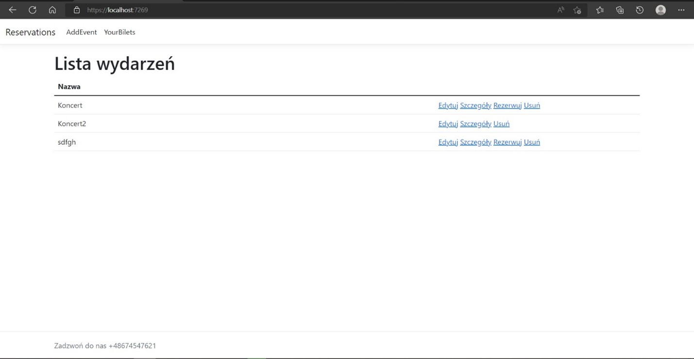
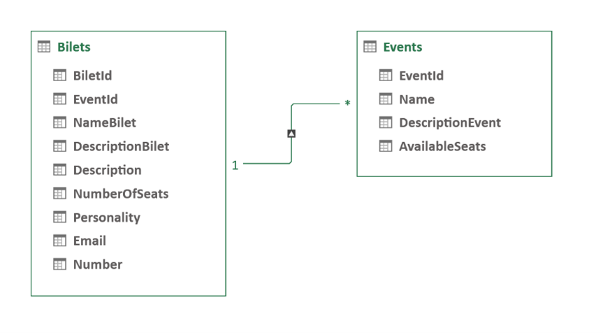

Aplikacja rezerwacja miejsc na wydarzenie.

1. Opis projektu.

Ta aplikacja umożliwia rezerwacje miejsc na wydarzenie z udostępnionej  listy. 
Opiera się na czterech modelach: model dla biletów (Biletmodel),model wydarzeń (EventModel),model dla pracy 
z bazą danych (DemoContext) i model ErrorViewModel. 

Były stworzone funkcję CRUD dla zarządzenia wydarzeniami i biletami. 
Dla pracy z bazą danych był użyty lokalny serwer Microsoft SQL Server Management Studio 
18. 

Aplikacja nie posiada logowania/rejestracji i nie ma podziału na administratora i 
zwykłego użytkownika, dlatego wszystkie przyciski modyfikowania wydarzenia też dostępne 
dla zwykłego użytkownika. 

2. Schemat bazy danych.

